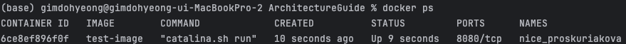
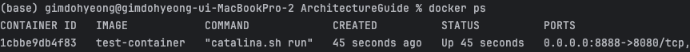

# ArchitectureGuide
studying of docker, containerd, kubernetes, k3s, k8s, ELK stack etc


## Docker
* ### Dockerfile
  * ### What is a dockerfile?
    * A dockerfile is a set of commands to configure and create a image.   
      It is possible to upload and read images only by the docker hub and automate prerequisites by shell, but it is ideal and faster to create and load images with 
      your servers specific needs.
    * #### `docker build -t my-image-name .`   
      This command will create a image called `my-image-name` reading a `Dockerfile` in the path `.`.
  * ### What are the components of a dockerfile?
    * ### `FROM`
      This keyword is used to import the base image of the dockerfile.
      ```dockerfile
      FROM python:3.10.13-alpine3.18
      ```
      The most common case of `FROM` is by the hubs repository:tagName.   
      Tag names are created by the providers of the image and mostly contains of OS information and versions.   
      ex : python3.10 installed in alpine3.18 OS.
    * ### `WORKDIR`
      This keyword specifies starting directory within the image.   
      If the directory does not exists, it will create the specified directory.   
      You can always change the directory multiple times in order to specify different locations for executions like `COPY` or `RUN`.
    * ### `COPY`, `ENV`
      ```dockerfile
      COPY /location-to-copy /in-image-location
      ```   
      Copies the file in the scope of the dockerfile project to the images location.   
      ```dockerfile
      ENV LOG_PATH=/etc/project/log
      ```
      Creates a environment variable in the image.
    * ### `RUN` vs `CMD`
      ```dockerfile
      FROM python:3.10.13-alpine3.18
      WORKDIR /etc/project
      COPY main.py
      
      RUN mkdir external-files \
      && apk --no-cache update

      RUN apk --no-cache add curl
      
      CMD curl www.google.com \
      python main.py
      ```   
      Both `RUN` and `CMD` receives shell commands but has a fundamental difference.   
      <br/>
      The `RUN` command is for creating the dockerfile.   
      And the `CMD` command is for commands to run at execution.   
      <br/>
      If you run `docker build .` with the dockerfile above, you will get this.   
         
      Note that each separation of `RUN` is separated as image layers.   
      You should divide them to reasonable layers in order to debug efficiently.   
      <br/>
      If you run `docker run` to the created image, you will get a http response of google and run your python script.    
    * ### Expose vs `-p`
      ```dockerfile
      FROM tomcat:10.1.17-jdk21-temurin-jammy
      EXPOSE 8080/tcp
      ```
      This dockerfile creates a tomcat container and opens the default port used by tomcat, 8080.   
      ```shell
      docker build -t test-container .
      docker run test-container
      ```
      If you run the `docker ps` command, you can see `8080/tcp` in the PORTS section.   
          
      <br />
      But if you create a dockerfile without `EXPOSE`
      ```dockerfile
      FROM tomcat:10.1.17-jdk21-temurin-jammy
      ```
      and run docker with using the `-p` command
      ```shell
      docker build -t test-container .
      docker run -p 8888:8080/tcp test-container
      ```
      
      `docker ps` command, returns `0.0.0.0:8888->8080/tcp`.   
      ### What does this mean?
      When a docker port needs to be accessed with other docker containers, `EXPOSE` is sufficient.   
      `EXPOSE` does not map the opened port with the hosts port.   
      You should use it if the application only needs to be accessed by other containers within the scope.   
      <br/>
      In the other hand `docker run -p <hostPort>:<containerPort>/tcp` opens and maps the port to be accessed by the host.   
      Therefor the `docker ps` shows `0.0.0.0:8888 (the hosts port)->8080/tcp (mapped to the containers port)`.      
      <br/>
      It would be best if we use this accordingly to our applications use case.
* ### docker-compose
  * ### What is docker-compose
    *    
      Lets say that you want to create a service.   
      You would want to create a database, a backend server, and a frontend server.   
      Well, docker compose got you covered, you can deploy all of these servers with a single command, `docker compose up`.   
      <br>
      It is just like a composer in a orchestra, handling multiple pods just in one go.
  * ### `docker-compose.yaml`
    * ### Basics
      ```yaml
      version: "3"
      services:
        frontend:
          build: frontend_file/.
          ports:
          - "8081:8080"
        backend:
          build: backend_file/.
          ports:
          - "8082:3000"
        database:
          image: "mysql:8.2.0"
      ```
      This `docker-compose.yaml` means,   
      1. Create 3 services named `frontend`, `backend`, `database`.   
      2. The `Dockerfile` located for each service is in `frontend_file/.`, `backend_file/.`.   
      3. For the database, use the image `mysql:8.2.0` from docker hub.   
      4. Connect the `frontend` pods port 8080 to 8081 of the host.
      5. Connect the `backend` pods port 3000 to 8082 of the host.
    * ### Volumes
      In docker, you can run `docker run -v <host-path>:<container-path> <image-name>` command in order use a path of the host as volumes to mount on your image.   
      <br>
      This is handy when you need to create multiple pods and shared volumes between services.
      ```yaml
      version: "3"
      services:
        database:
        image: mysql:8.2.0
        volumes:
         - ./host-file-path:/var/lib/mysql
      ```
      The volumes is an array of `<host_path>:<container_path>` that you want to mount.   
      After you mount a volume, changes either in the host or the container will affect each other as it is a "mounted" volume.   
      <br>
      try the `docker exec -it <mycontainer> bash` command, to double check.   
      Some IDEs like jetbrains allow you to connect by UI.    
      
    * ### Environment variables
         
      if you have ran the `image: mysql:8.2.0` image above, you will see this error.
      This is because the environment variable for the mysql connection is not set.   
      ```yaml
      version: "3"
      services:
        my-service-name:
          image: my-image-name
        environment:
          - MYSQL_ROOT_PASSWORD=value1
          - MYSQL_ALLOW_EMPTY_PASSWORD=value2
          - MYSQL_RANDOM_ROOT_PASSWORD=value3
      ```
      You can also set environment variables in docker-compose.   
      We did learn that `ENV` in Dockerfile also changes the environment variable.   
      It would be a matter of taste where to put it, so just pick one, and do not cross use it.
    * ### depends_on
      This keyword is for a service to start only after the service that it depends on.   
      The frontend should never start before the backend.
      ```yaml
      version: '3'

      services:
        backend:
          image: backend-image-location

        frontend:
          image: frontend-image-location
          depends_on:
          - backend
      ```
    * ### Replicas
      Just note that this feature exists, but do not use this unless you are using docker swarm.
      Most companies do not use swarm over k8s.
      ```yaml
      version: "3"
        services:
          database:
            image: "mysql:8.2.0"
            ports:
            - "8080:3000"
            deploy:
              replicas: 3
      ```
      Also, you cannot bind 3 replicas ports with localhost port of 8080.   
      So you should create 3 services separately or remove the host port.   
      <br>
      If you are thinking of creating a load balancer within `docker-compose` and redistribute traffic, I strongly advise you to just use
      kubernetes service and deployments.   
      <br>
      It is possible with nginx, but not recommended. kubernetes should handle replicas and traffic, not docker.   

## Kubernetes
* ### Why do we need microservices? [Mastering chaos - Netflix](https://www.youtube.com/watch?v=CZ3wIuvmHeM&t=1218s)   
  
  From the year 2000, Netflix had a monolith architecture that scales horizontally.   
  They used two databases "STORE" and "BILLING" which had no replicas whatsoever.   
  As time goes on, their main server has become this massive chunk of code which was over their heads, dies constantly, takes all day to boot and debug.
  * #### Massive chunk of code
  * #### Massive dependencies
  * #### Massive cost on boot and debugging
  * #### High usage of threads and processes
  * #### New features can kill the whole service
  * #### A bad query can kill the whole service
  * #### Massive cost updating databases and columns
  
  That is where the microservice architecture comes in.   
  This architecture is where a service is divided into multiple parts.   
  <br>
  Netflix
  * user-api
  * product-api
  * platform-api
  * Persistence (Databases)
  * ...
      
  <br>

  This did solve the main problems of a monolith architecture, but it has its downfalls.   
  * #### Cascading failures
    When a feature accesses multiple api, a single point that fails will result in another point to fail and continues until it kills the whole system.   
       
    In Netflix, they have solved it by a static response to be returned in case of a failure.    
    This blocks and isolates the failed endpoint. and continues the service with failure in mind.
  * #### Database Persistence
    If a service wants to change data to 3 different regions of databases, but cannot access to some of them, should the process fail?
    Should the process write to one, and apply the changes later?   
    <br>
    Now netflix used a nosql database called "Cassandra" which manages multiple database nodes and keeps persistence with each other nodes.   
    <br>
    This might be a overkill for most companies, but it's good to know a service that handles databases the "microservice" way.
    
  * #### Stateful Service
    If a node keeps a "state", it means that it stores data within that node that is relevant to the service.
    The "user" must keep contacting this "service node" because it keeps it's "state" within.   
    If a service is "stateful" the loss is a "cost" that results in a failure of a service.   
    If a service is "stateless" the loss of a node has no impact on the service as the user can contact another node.
* ## Kubernetes components
  Kubernetes is a microservice management tool constructed with multiple components.   
  <br>
  * Master nodes
    * API Server
      * Kubernetes dashboard
      * API
      * Kubectl
    * Control Manager
    * Scheduler
    * etcd
    * Deployment
      * Service
  * Worker nodes
    * Pods
      * Containers

  I will be giving examples on how to set up a kubernetes server without a cloud provider or external tools.   
  You can configure kubernetes just by configuring UI managed by AWS
  [EKS](https://aws.amazon.com/eks/?nc1=h_ls) or [EKSCTL](https://github.com/eksctl-io/eksctl).   
  Studied from the [official documentation](https://v1-28.docs.kubernetes.io/docs/setup/production-environment/tools/).
  * ### Master node (Control plane)
    * The master node is where all worker nodes are managed.   
      It is a control plane that communicates via the API server in order to control the cluster.   

    * ### API Server